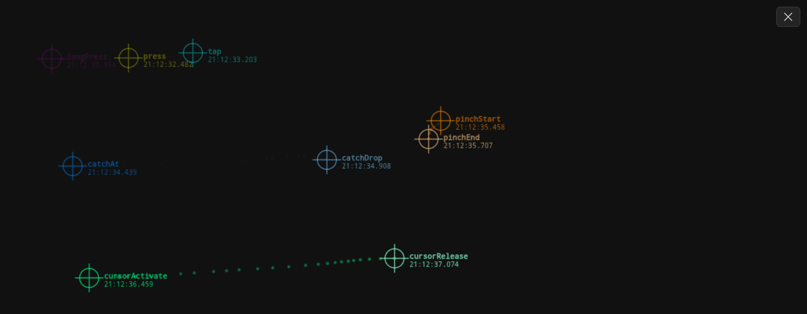
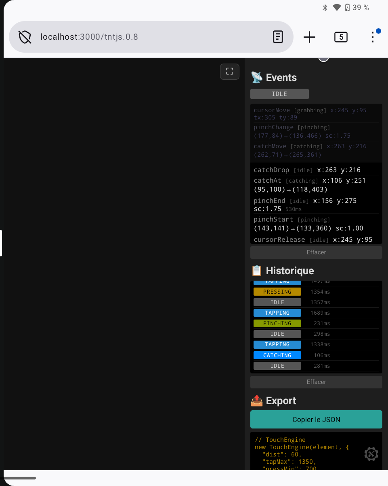

# TNT.js — tinyTouch

**[Demo live →](https://s1pierro.github.io/tnt.js/)**

Module JavaScript d'abstraction des interactions tactiles pour applications mobiles.  
Conçu pour surmonter l'occlusion du doigt sur écran et offrir une précision de pointage accrue.

**Version 0.8.5** — ES module, zéro dépendance. Surfaces tactiles uniquement.

---

## Concept

Sur mobile, le doigt masque ce qu'il touche. TNT déplace le point de pointage actif au-dessus du doigt via un **curseur déporté**, maintenu à distance fixe du doigt par une barre rigide. Le module expose également une machine à états pour tous les gestes courants : tap, press, longPress, grab, pinch.

```
  ╭───────────╮
  │   contact   │  ← point de contact réel (sous le doigt)
  │     ●       │
  ╰─────│─────╯
         │  ← bras rigide (dist px, rotation libre)
         │
      ╭─▼─╮
      │ ●  │  ← curseur déporté (point de travail visible)
      ╰───╯
```

Toutes les coordonnées émises dans les événements sont **relatives à l'élément** écouté, pas au viewport.

<p align="center">
  
</p>

---

## Installation

Copier `tnt.js` dans le projet et l'importer en tant que module ES :

```js
import { TouchEngine, CursorKinematics, TouchOverlay, DropCursor, TouchPanel } from './tnt.js';
```

Aucun build requis. Compatible avec tout navigateur mobile moderne (Chrome Android, Safari iOS, Samsung Internet).

**Usage minimal** — overlay + panneau de configuration intégré :

```js
const overlay = new TouchOverlay(document.getElementById('stage'));
const panel   = new TouchPanel(overlay);   // modal configurable, toggle via 5 doigts

overlay.engine.on('tap',      e => console.log('tap', e.x, e.y));
overlay.engine.on('longPress', e => console.log('longPress', e.x, e.y));
```

`TouchPanel` gère automatiquement : réglages de l'overlay, `DropCursor` intégré, console d'événements, historique des états, export de configuration et raccourci 5 doigts (`tntBang`).

---

## Machine à états

<table align="center" width="100%" cellspacing="0" cellpadding="12" border="0">
  <tr>
    <td align="center" valign="middle" width="45%">
      
      <br/><sub><b>historique des transitions &nbsp;·&nbsp; badges colorés par état &nbsp;·&nbsp; durée de chaque phase</b></sub>
    </td>
    <td valign="middle" width="55%">
<pre>
         ┌────────────────────────────────────────┐
         │         5 doigts (tout état)            │
         ▼                                         │
IDLE ─(1 doigt)──► TAPPING ─(dépl.)──► GRABBING ──► IDLE
          │            │                             ▲
          │            ├──(frontier1)──► PRESSING      │
          │            │                  │           │
          │            │           LONGPRESSING        │
          │            │                              │
          │            └──(2 doigts)──► PINCHING ─────┘
          └──────────────────────────────────────────┘
</pre>
    </td>
  </tr>
</table>

### Règles de transition

| De | Vers | Condition |
|---|---|---|
| `idle` | `tapping` | premier contact |
| `tapping` | `pressing` | `tappingToPressingFrontier` ms écoulées |
| `pressing` | `longPressing` | `pressingToLongPressingFrontier` ms écoulées au total |
| `tapping` | `grabbing` | déplacement du doigt ≥ `dist` px |
| `tapping` | `pinching` | 2e doigt posé |
| `pressing` / `longPressing` | `idle` | déplacement ≥ `dist` (annulation) |
| tout état | `idle` | 5 doigts simultanés |
| `grabbing` | `idle` | doigt relevé |
| `pinching` | `idle` | tout doigt relevé |

---

## API

### `TouchEngine`

Moteur principal. Capture les événements touch et émet les événements de geste.

```js
const engine = new TouchEngine(element, options);
```

#### Options

| Paramètre | Type | Défaut | Description |
|---|---|---|---|
| `dist` | `number` | `80` | Distance (px) à partir de laquelle le geste passe en `grabbing` ; aussi la longueur de la barre du curseur |
| `tappingToPressingFrontier` | `number` | `500` | Frontière (ms) tapping → pressing |
| `pressingToLongPressingFrontier` | `number` | `1500` | Frontière (ms) pressing → longPressing |

> Aucune zone morte : tout relâché émet exactement un événement (`tap`, `press` ou `longPress`).

#### Getters / Setters

Toutes les options sont accessibles et modifiables à l'exécution :

```js
engine.dist                          = 60;
engine.tappingToPressingFrontier     = 400;
engine.pressingToLongPressingFrontier = 1400;
```

#### Propriétés en lecture

| Propriété | Type | Description |
|---|---|---|
| `state` | `string` | État courant : `'idle'` `'tapping'` `'pressing'` `'longPressing'` `'grabbing'` `'pinching'` |
| `cursor` | `{x, y, active}` | Position du curseur déporté, en coordonnées relatives à l'élément |
| `isGrabbing` | `boolean` | Raccourci : `state === 'grabbing'` |
| `touchCount` | `number` | Nombre de doigts actuellement posés |

#### Méthodes

```js
engine.on(type, handler)   // Abonnement à un événement
engine.emit(type, data)    // Émission manuelle (tests, extensions)
engine.destroy()           // Retire tous les listeners (à appeler en démontage)
```

---

### Événements émis

Tous les handlers reçoivent un objet de données. S'abonner avec `engine.on(type, fn)`.  
Toutes les coordonnées `x`, `y`, `touchX`, `touchY` sont **relatives à l'élément**.

#### `stateChange`
Émis à chaque transition d'état.
```js
{ state: 'grabbing' }
```

#### `tap`
Contact bref, sans déplacement significatif.
```js
{ x, y, intensity, precision }
```
- `intensity` `[0–1]` : durée normalisée (`dt / tappingToPressingFrontier`). Proche de 0 = tap vif, proche de 1 = tap à la limite du press.
- `precision` : distance maximale (px) parcourue par le doigt depuis le départ.

#### `press`
Contact moyen, entre les deux frontières temporelles.
```js
{ x, y, intensity, precision }
```
- `intensity` `[0–1]` : `(dt − b1) / (b2 − b1)` où `b1` = `tappingToPressingFrontier`, `b2` = `pressingToLongPressingFrontier`.

#### `longPress`
Contact long, maintenu au-delà de `pressingToLongPressingFrontier`.
```js
{ x, y, msAfterMin, precision }
```
- `msAfterMin` : millisecondes au-delà de `pressingToLongPressingFrontier`.

#### `cancel`
Un geste `pressing` ou `longPressing` annulé parce que le doigt a bougé au-delà de `dist`.
```js
{ x, y, state: 'idle' }
```

#### `cursorActivate`
Le grab commence : le curseur déporté apparaît.
```js
{ x, y, touchX, touchY, state }
```
- `x, y` : position initiale du curseur déporté (à `dist` px du doigt, dans la direction opposée au mouvement).
- `touchX, touchY` : position du doigt.

#### `cursorMove`
Le doigt se déplace pendant un grab.
```js
{ x, y, touchX, touchY, state }
```
- `x, y` : position du curseur déporté (toujours à exactement `dist` px du doigt).

#### `cursorRelease`
Le grab se termine.
```js
{ x, y, activatedAt: {x, y}, vector: {x, y}, state: 'idle' }
```
- `activatedAt` : position du curseur à l'activation.
- `vector` : vecteur déplacement depuis l'activation.

#### `cancelCursor`
Annulation par 5 doigts pendant un grab.
```js
{ x, y, state: 'idle' }
```

#### `pinchStart` / `pinchChange` / `pinchEnd`
Geste de pincement à 2 doigts.
```js
// pinchStart / pinchChange
{ scale, state }

// pinchEnd
{ scale, duration, state: 'idle' }
```
- `scale` : ratio distance courante / distance initiale. `1.0` = pas de changement, `> 1` = écartement, `< 1` = rapprochement.
- `duration` : durée totale du pinch en ms.

---

### `CursorKinematics`

Positionnement rigide du curseur déporté. Maintient le curseur à distance fixe du doigt, avec rotation libre de la barre. Indépendant du DOM.

```js
const kine = new CursorKinematics(options);
```

#### Options

| Paramètre | Type | Défaut | Description |
|---|---|---|---|
| `dist` | `number` | `80` | Distance fixe entre le doigt et le curseur (px) |

#### Propriétés

| Propriété | Type | Description |
|---|---|---|
| `x`, `y` | `number` | Position courante du curseur |
| `dist` | `number` | Distance fixe, modifiable à l'exécution |
| `initialized` | `boolean` | `true` si le curseur a été positionné au moins une fois |

#### Méthodes

```js
kine.init(px, py)
// Place le curseur à dist px à droite du point de contact.

kine.activate(cursorX, cursorY, touchX, touchY)
// Place le curseur à dist px du doigt, dans la direction du vecteur curseur→doigt.
// À appeler au cursorActivate.

kine.update(px, py)
// Replace le curseur à exactement dist px du doigt, en conservant la direction courante.
// À appeler à chaque cursorMove.

kine.reset()
// Réinitialise le curseur (initialized = false).
// À appeler au cursorRelease et cancelCursor.
```

> `CursorKinematics` et `TouchEngine` appliquent la même formule géométrique : les coordonnées `x, y` émises dans les événements correspondent toujours à `kine.x`, `kine.y`.

---

### `TouchOverlay`

Classe tout-en-un : crée et gère les éléments DOM du curseur déporté.  
Utile pour un prototypage rapide ou un usage standard sans personnalisation visuelle avancée.

```js
const overlay = new TouchOverlay(container, options);
```

Accepte toutes les options de `TouchEngine` et `CursorKinematics`, plus :

| Paramètre | Type | Défaut | Description |
|---|---|---|---|
| `contactSize` | `number` | `24` | Taille du point de contact (px) |
| `cursorSize` | `number` | `14` | Taille du curseur déporté (px) |
| `rodEnabled` | `boolean` | `true` | Affiche le bras entre contact et curseur |
| `pulseEnabled` | `boolean` | `true` | Pulse d'animation à l'activation du grab |

#### Accesseurs

```js
overlay.engine          // → TouchEngine sous-jacent
overlay.kine            // → CursorKinematics sous-jacent
overlay.contactSize = v // modifiable à l'exécution
overlay.cursorSize  = v
overlay.rodEnabled  = v
overlay.pulseEnabled = v
```

---

## Exemples d'intégration

### Sélection d'une pièce LEGO (tap)

```js
const engine = new TouchEngine(canvas);

engine.on('tap', ({ x, y, intensity }) => {
  const piece = board.pieceAt(x, y);
  if (!piece) return;

  if (intensity < 0.3) {
    // tap vif → sélection simple
    board.select(piece);
  } else {
    // tap appuyé → sélection avec info-bulle
    board.selectWithTooltip(piece);
  }
});
```

### Déplacement d'une pièce (grab)

```js
const engine = new TouchEngine(canvas, { dist: 60 });
const kine   = new CursorKinematics({ dist: 60 });

let draggedPiece = null;

engine.on('cursorActivate', ({ x, y, touchX, touchY }) => {
  kine.activate(x, y, touchX, touchY);
  draggedPiece = board.pieceAt(x, y);
  if (draggedPiece) board.beginDrag(draggedPiece);
});

engine.on('cursorMove', ({ x, y, touchX, touchY }) => {
  // x, y sont déjà les coordonnées correctes du curseur déporté ;
  // kine.update() peut être utilisé si vous gérez l'affichage vous-même.
  kine.update(touchX, touchY);
  if (draggedPiece) board.moveDragTo(x, y);
});

engine.on('cursorRelease', ({ x, y }) => {
  kine.reset();
  if (draggedPiece) {
    board.dropAt(x, y);
    draggedPiece = null;
  }
});
```

### Suppression par longPress

```js
engine.on('longPress', ({ x, y, msAfterMin, precision }) => {
  // precision garantit que le doigt n'a pas bougé (pas un déplacement accidentel)
  if (precision < 10) {
    const piece = board.pieceAt(x, y);
    if (piece) board.remove(piece);
  }
});

// Si le doigt bouge trop pendant le longPress → annulation propre
engine.on('cancel', () => {
  board.cancelPendingAction();
});
```

### Zoom de la vue (pinch)

```js
let baseScale = 1;

engine.on('pinchStart', () => {
  baseScale = board.scale;
});

engine.on('pinchChange', ({ scale }) => {
  board.scale = Math.max(0.5, Math.min(4, baseScale * scale));
});
```

### Overlay complet + panneau de configuration

```js
const overlay = new TouchOverlay(document.getElementById('stage'), {
  dist:                           60,
  tappingToPressingFrontier:      400,
  pressingToLongPressingFrontier: 1400,
  contactSize:  28,
  cursorSize:   16,
  rodEnabled:   true,
  pulseEnabled: true,
});

// Panneau modal (toggle via 5 doigts maintenus)
const panel = new TouchPanel(overlay);

// panel.drop        → DropCursor intégré
// panel.markerTtl   → durée des marqueurs (ms)
// panel.trailTtl    → durée de la traînée (ms)
// panel.trailEnabled → traînée active

overlay.engine.on('tap',      e => selectPiece(e));
overlay.engine.on('longPress', e => deletePiece(e));
```

---

## Réglage des paramètres temporels

```
  0ms       tappingToPressingFrontier   pressingToLongPressingFrontier
   │──────────────────┼──────────────────────────┼──────────►
   │     TAPPING      │        PRESSING           │ LONGPRESSING
   │                  │                           │
   │ tap émis         │ press émis                │ longPress émis
   │ à relâché        │ à relâché                 │ à relâché
```

Aucune zone morte : tout relâché émet exactement un événement.

**Annulation par déplacement** : pendant `pressing` ou `longPressing`, si le doigt parcourt plus de `dist` px, l'événement `cancel` est émis à la place de `press` / `longPress`.

---

## Notes techniques

- **Coordonnées relatives** : toutes les coordonnées émises sont relatives à l'élément écouté (pas au viewport). Le `getBoundingClientRect()` est mis en cache au début de chaque geste.
- **Barre rigide** : le curseur déporté est maintenu à exactement `dist` px du doigt. Aucune simulation physique, aucun rebond — précision maximale.
- **Précision temporelle** : les durées utilisent `performance.now()` (résolution sub-milliseconde).
- **5 doigts** : n'importe quel état est annulé proprement si 5 doigts ou plus sont détectés simultanément.
- **Touch uniquement** : les événements souris ne sont pas pris en charge. Module conçu pour surfaces tactiles.

---

## Compatibilité

| Environnement | Support |
|---|---|
| Chrome Android 90+ | ✅ |
| Safari iOS 14+ | ✅ |
| Firefox Android | ✅ |
| PWA / standalone | ✅ |
| Bundler (webpack, vite…) | ✅ (ES module natif) |

---

## Changelog

### 0.8.5 — 2026-04-04
- Suppression du support souris : module touch uniquement
- `CursorKinematics` : suppression du ressort (friction/stiffness) — barre rigide, distance fixe
- Coordonnées relatives à l'élément dans tous les événements (correction du décalage viewport)
- Cohérence garantie entre `engine.cursor` et `kine.x/y` : les valeurs émises correspondent à l'affichage

### 0.8.4
- Correction du calcul d'intensité pour les taps
- Ghost clicks mobiles supprimés
- `performance.now()` à la place de `Date.now()`

### 0.8.x
- Machine à états complète : `tapping` / `pressing` / `longPressing` pilotés par `setTimeout`
- Événement `stateChange` à chaque transition
- Annulation `cancel` par déplacement pendant press/longPress
- Payloads enrichis : `intensity`, `precision`, `activatedAt`, `vector`, `msAfterMin`
- Getters/setters publics sur `TouchEngine` ; `CursorKinematics.reset()`
- `TouchOverlay` : fix `_show`/`_hide` (opacity inline)

---

## Auteurs

- **s1pierro** — conception, architecture, design des gestes
- **Claude Sonnet 4.6** (Anthropic) — co-développement, implémentation, documentation

---

## Licence

MIT — voir [LICENSE](./LICENSE)

Copyright © 2026 s1pierro
